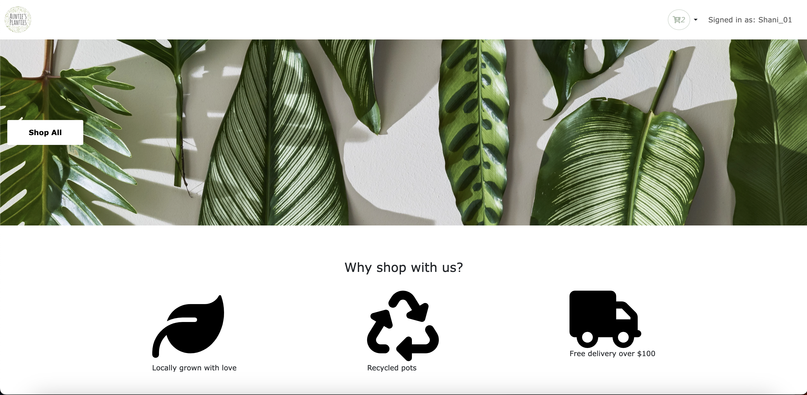
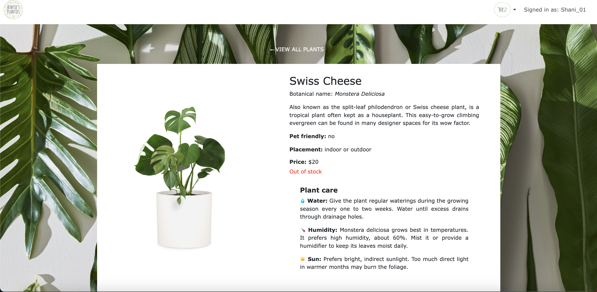
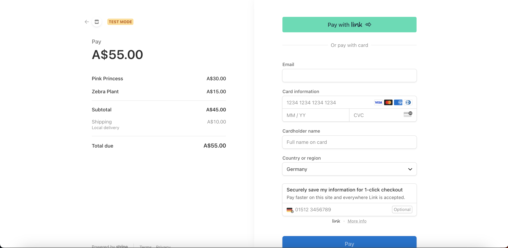

# Aunties Planties

## Table of Contents

- [Aunties Planties](#aunties-planties)
  - [Table of Contents](#table-of-contents)
  - [Introduction](#introduction)
  - [Features](#features)
  - [Screenshots](#screenshots)
  - [Getting Started](#getting-started)
    - [Prerequisites](#prerequisites)
    - [Installation](#installation)
  - [Demo](#demo)

## Introduction
Aunties Planties is an online store where users can purchase house plants. Users can login and browse different plants to see images and care instructions for  each plant. Finally they can add items to their cart and purchase their items via credit card payment provided by integration with Stripe. The web application is built using ReactJS as the front end library (with input Contaxt API for state management), Express JS as the backened server, MongoDB as the no-SQL database, Cloudinary as the  image hosting service and web technologies Javascript, HTML and CSS.

## Features

- **Landing Page:** Users are welcomed to the site via the landing page. Here, users are given the option to login or sign up, as well as information about the platform.

- **User Registration and Authentication:** Aunties Planties ensures a secure environment by requiring user registration and authentication to unlock cart functionality. Routes are protected with middleware to provide client side user validation via JWT.

- **Product list page:** Users can view all plants available on the platform via the product list page. A user-friendly filtering mechanism allows users to browse plants by name, as well as srot accoerding to price and alphabetically.

- **Product Details:** User's can browse detailed information of different plants, viewing images and care and maintenance information.

- **Cart functionality** Once logged in, users can add items to their cart. On the cart page, users can increase or decrease the quantity they wish to purchase and view cart totals

- **Payment :** After adding the desired products to their cart, users can complete their order by using the credit card payment functionality via Stripe.

- **Cloudinary Integration:** Aunties Planties seamlessly handles images using the Cloudinary service.

## Screenshots

## Getting Started

### Prerequisites

Before you get started, make sure you have the following:

- [Node.js](https://nodejs.org/) installed on your machine.
- Mongoose DB running

### Installation

1. **Clone this repository:**

git clone https://github.com/shaniperera/aunties-planties

2. Install the dependencies:

 ``npm install``

3. Start the front as well as the back end backend server concurrently: 

``npm run fullstack``

4. Open your web browser and navigate to http://localhost:5173 to access Aunties Planties app locally.

## Demo
Google slides for the demo can be found [here](https://docs.google.com/presentation/d/1Vz8T4SZfG-dkbUATO7QyWwbYX8Bj0q4hdbeBkDmFgmM/edit?usp=sharing).